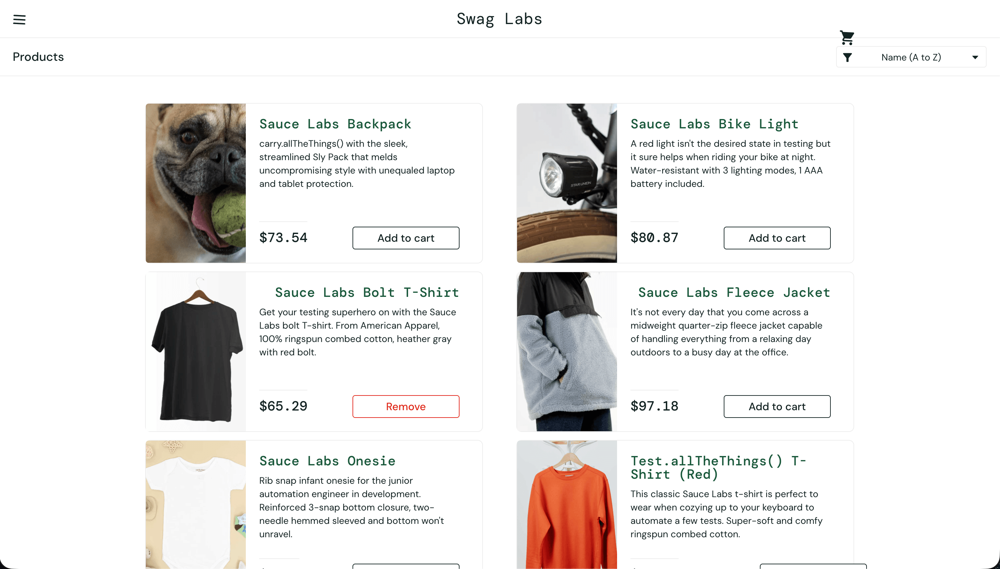

# Bug Report

**Bug ID:** BUG-CART-01 \
**Title:** Cart counter is missing after adding a product to the cart \
\
**Summary:** After adding a product to the cart from the product catalogue, the product is added successfully and the button changes from `Add to cart` to `Remove`. However, the cart counter is not displayed near the cart icon, so the user cannot see how many items have been added to the cart. \
\
**Severity:** Medium \
**Priority:** Medium \
**Reproducibility:** Always \
\
**Environment**
- Application: Swag Labs
- Environment: Demo / Test
- Browser: Chrome Version 148.0.7778.178
- Device: Desktop
- OS: macOS
- URL: https://www.saucedemo.com/inventory.html

**Preconditions** 
- User is logged in as `standard_user`
- User is on the product catalogue page

**Steps to Reproduce** 
1. Log in as `standard_user`
2. Find `Sauce Labs Bolt T-Shirt`
3. Click `Add to cart`
4. Observe the cart icon in the header

**Expected Result:** The cart counter should appear near the cart icon and display the number of added products, for example `1`. \
**Actual Result:** The product is added successfully and the button changes to `Remove`, but the cart counter is not displayed near the cart icon. \
**Attachments / Evidence** \
Screenshot:  \
**Notes:** This issue may affect user confidence because the cart state is not clearly visible after adding a product.
