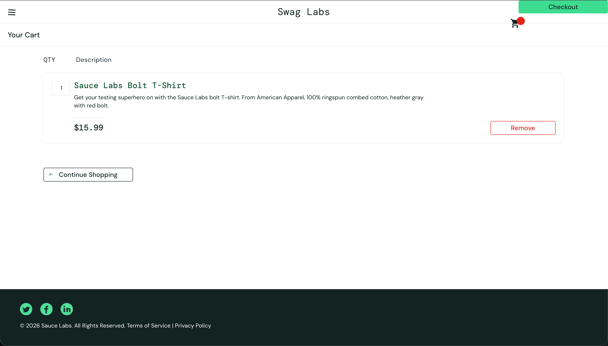

# Bug Report

**Bug ID:** BUG-CHECKOUT-01 \
**Title:** Cart badge count is missing on the checkout page \
\
**Summary:** On the checkout page, the selected product is displayed correctly, but the cart badge in the header does not show the item quantity. A red badge indicator is visible, but the numeric count is missing.

**Severity:** Medium \
**Priority:** Medium \
**Reproducibility:** Always

**Environment:**
- Application: Swag Labs
- Environment: Demo / Test
- Browser: Chrome Version 148.0.7778.178
- Device: Desktop
- OS: macOS
- URL: https://www.saucedemo.com/cart.html

**Preconditions:**
- User is logged in as `standard_user`
- `Sauce Labs Bolt T-Shirt` is added to the cart
- User is on the cart page / checkout entry point

**Steps to Reproduce:**
1. Log in as `standard_user`
2. Add `Sauce Labs Bolt T-Shirt` to the cart
3. Open the cart page
4. Observe the cart badge in the header

**Expected Result:** The cart badge should display the number of items in the cart, for example `1`. \
**Actual Result:** The selected product is displayed in the cart, but the cart badge shows only a red indicator without the numeric count.

**Attachments / Evidence**
Screenshot: 
